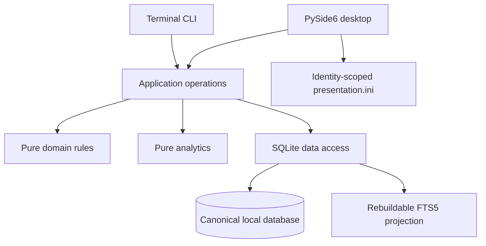

# Reckonsolve architecture

Current implementation: v0.8.0, schema 20, search projection 3, CSV format 5.
Last reviewed: 2026-10-06.

The [product specification](product-spec.md) governs behavior. This document describes implemented boundaries. Detailed decisions are in [ADRs](decisions/README.md); the earlier chronological account is preserved in the [architecture archive](archive/architecture-through-v0.8.md).

## 1. System context

Reckonsolve is a native Windows, single-user, offline desktop journal with a companion CLI. Python 3.13 is managed by uv. PySide6 is the runtime UI dependency; persistence and CLI parsing use the standard library. pytest, pytest-qt, and Ruff are development tools. Pinned PyInstaller is isolated in the packaging dependency group for private builds.

Presentation collects and renders values. Application operations coordinate use cases. Domain rules and analytics do not depend on Qt or open databases. Data access owns SQL, row mapping, migration, and transactions. Lower layers never import presentation modules. Prefer explicit modules and data flow over service containers or speculative infrastructure.

## 2. Composition and identities

`app.py` composes QApplication, Database, PredictionOperations, presentation settings, and MainWindow into ApplicationRuntime. `cli.py` composes a command's Database and the same operations into CliRuntime without constructing the desktop UI. Both close persistence deterministically, including after expected failures.

| Entry points | Identity | Data directory |
| --- | --- | --- |
| reckonsolve; python -m reckonsolve; reckonsolve-cli / rsc | Stable | %LOCALAPPDATA%\Reckonsolve |
| reckonsolve-dev; reckonsolve-cli-dev / rscd | Development | %LOCALAPPDATA%\Reckonsolve Dev |

Identity is selected before path resolution. Each directory contains reckonsolve.sqlite3 and a separate presentation.ini. Tests and private smoke inject explicit temporary database paths. Normal commands do not offer arbitrary database selection, discover test paths, fall back to another identity, or copy data between identities. CLI help/version opens no database.

An installed uv tool is a source snapshot independent of ongoing checkout edits. Matching GUI/CLI processes share local SQLite directly; normal refresh/navigation/restart observes another process's successful write. There is no watcher, daemon, synchronization ledger, API, or hosted service.

## 3. Module responsibilities

Paths below are relative to src/reckonsolve/.

| Boundary | Main modules | Responsibility |
| --- | --- | --- |
| Composition | app.py, cli.py, identity.py, paths.py | Identity, lifetime, entry points, injected clock/paths. |
| Application | application/predictions.py, application/quantiles.py, application/one_shot.py | Complete actions, reviewed-context checks, read models, expected-error translation. |
| Domain | domain/forecast_contracts.py, domain/predictions.py, domain/quantiles.py, domain/one_shot.py | Closed identities, lifecycle/time rules, exact values, complete statements and documentary times. |
| Persistence | data/database.py, data/migrations.py, data/predictions.py, data/quantiles.py, data/one_shot.py | Connections, immutable schema history, model-aware transactions and reads. |
| One-Shot replay | data/one_shot_facts.py, data/one_shot_archive.py | Independently checked original/correction replay and effective archive facts. |
| Retrieval | data/search_index.py, data/search.py, data/saved_views.py, data/tags.py | Derived projection, grouped hits, dynamic preferences and tag transactions. |
| Analytics | analytics/trajectory.py, analytics/quantiles.py, analytics/one_shot.py and aggregate modules | Exact selection/scoring and separate observation populations. |
| Transfers | data/transfer.py | Verified online backup and snapshot-based CSV ZIP. |
| Desktop | ui/ | Screens/dialogs, shared styles/icons, charts/text alternatives, notifications and preferences. |
| Terminal | cli_creation.py, cli_mutations.py, cli_one_shot.py | Human prompts/rendering through shared operations. |

`data/numeric_predictions.py` remains shared supported storage infrastructure; its historical name is not permission to restore interval-v1 behavior. Historical migration SQL remains immutable even where its original runtime model has been retired.

## 4. Compatibility and migrations

The supported matrix is closed:

| Mode / type | Forecast model | Scoring contract |
| --- | --- | --- |
| Adaptive Binary | binary-trajectory-v1 | binary-trajectory-brier-v1 |
| Adaptive Numeric | numeric-quantiles-5-v2 | numeric-wis-v1 |
| One-Shot Binary | binary-one-shot-v1 | binary-one-shot-brier-v1 |
| One-Shot Numeric | numeric-one-shot-5-v1 | numeric-one-shot-wis-v1 |

Adaptive is presentation terminology; canonical mode deadline remains unchanged. CLI --mode adaptive maps to it, and --mode deadline remains an alias. One-Shot uses canonical one_shot. Model/scoring identity is immutable canonical data, not inferred from package version, metadata_version, or table population.

Startup, migrations, ordinary reads/writes, repair, backup, and export enforce compatible identities. Any retired-only or mixed-with-retired archive, missing/unknown/mismatched pair, unsupported schema, or malformed history fails clearly without conversion, deletion, repair, or partial loading. Compatibility checks occur before mutation and surround shared transactions. No startup failure silently replaces an existing database. See [ADR 0019](decisions/0019-retire-legacy-runtime-without-rebuilding-history.md).

Migrations are lightweight, ordered, history-validated, transactional, foreign-key checked, and covered by rollback tests. Already-applied migration SQL is never edited. Supported Binary schema-16/17 and supported schema-18/19 archives upgrade through schema 20 preserving canonical facts.

- Schema 16 stores immutable contracts and prospective exact times.
- Schema 17 supports trajectory terminal correction/read integration.
- Schema 18 adds immutable five-quantile definitions/revisions and explicit shared anchors.
- Schema 19 adds two One-Shot pairs, documentary times, and transcription snapshots.
- Schema 20 adds only nullable, constrained Saved View forecast_mode; null preserves All modes.

Historical tables needed for supported storage/migration are not extra supported runtime contracts.

## 5. Canonical history and transactions

One standard-library sqlite3 connection per runtime enables foreign keys, a five-second busy timeout, and explicit immediate write transactions. Reads requiring a coherent history or aggregate use one checked snapshot. Independent processes may read simultaneously; sequential writes are the intended workflow. Lock/stale failures are bounded and never silently overwrite, merge, or retry indefinitely.

Each mutation rechecks ownership, current model, lifecycle, reviewed revision/metadata/correction tokens, and action-specific constraints under transaction access. System time is sampled at the authoritative commit boundary. Dirty searchable text is projected before commit; canonical writes and their search changes commit or roll back together.

Atomic units include:

- Creation: Prediction, immutable identity/definition, initial complete forecast, metadata/tags, and optional One-Shot answer.
- Adaptive revision/Review: current eligible anchor and clock checks, then one immutable record.
- Journal: current forecast anchor plus one immutable entry; body correction appends a version without moving the entry.
- Metadata: permitted current fields, protected Definition snapshot when required, tags/search, and concurrency token.
- Resolution/Invalidation: one immutable terminal decision; correction appends before/after facts with reviewed-current checks.
- One-Shot Add answer: first original answer and documentary report, without another forecast.
- One-Shot Correct transcription: complete validated before/after snapshot and app timestamp.
- Postmortem Skip: one immutable completion, with Resolved/blank/reflection-context checks.
- Tag maintenance: confirmed relationships, stable references, metadata tokens, and all affected search documents.
- Guarded Delete: revalidated untouched Open parent and its eligible child rows, without orphans.

Expected errors are translated to clear application failures; unexpected exceptions are not suppressed. One-Shot writes return a complete OneShotDetail before commit, avoiding a second read that might fail after a successful save. Creation and correction forms never request scores before Save.

## 6. Adaptive history and scoring

Exact event instants are canonical UTC text. Adaptive t0 is sequence-one commit, T the immutable Deadline, R the latest effective resolution instant, and C=min(R,T). T must exceed t0. Revisions are system-timestamped, strictly ordered, and commit before T; Reviews also stop at T. A regressed clock rejects the write instead of fabricating time. At T a nonterminal record is Locked.

Resolution's recorded-at is immutable system time. Effective R is the earliest defensible fixed/ascertainable instant and cannot exceed original recorded-at. Outcome/value/time changes require an explanation and append terminal history. Forecasts at/after C remain visible but unscored. R<=t0 yields an explicit no-score state.

Binary scoring uses exact microsecond standing durations and Fraction-valued Trajectory Brier, with the fixed T-t0 denominator and 0.25 neutral truncation after early R. Neutral truncation never creates a revision. Initial/Final/Hold-initial/Updating Gain and Active Forecast Fraction are diagnostics. Aggregate means give one equal vote per eligible Prediction; final-probability calibration is separate.

Numeric definitions fix unit, precision, and continuous-style/whole-number semantics. Complete immutable rows hold five scaled integers ordered q05<=q25<=q50<=q75<=q95. Journals, Reviews, and original Resolutions have one explicit model-appropriate revision anchor. Scoring derives the last complete revision strictly before C; a captured anchor is audit context, not selection authority. WIS is exact, with no trajectory or neutral contribution. Initial/Final/Delta comparisons are individual; aggregate improvement uses direction counts only.

Continuous-style calibration uses inclusive frequencies and pointwise 95% Wilson intervals. Whole-number calibration preserves strict/inclusive ties and inclusive 50%/90% outcome balances. No raw WIS/Delta mean or interpolated CDF observation is produced. See [ADRs 0017](decisions/0017-derive-trajectory-scores-from-terminal-facts.md) and [0018](decisions/0018-five-quantile-revisions-and-shared-anchors.md).

## 7. One-Shot persistence and replay

One-Shot records one final guess before checking an existing answer. There is no Deadline, normal revision/Review, cutoff selection, trajectory, or updating metric. Reported forecast/reveal wall minutes, approximation flags, and optional offsets are documentary. System app-entry/correction instants are separate audit facts. Neither timing source selects score observations.

Original forecasts reuse sequence one in supported revision tables. Original answers reuse type-specific Resolution tables with null effective time. one_shot_forecast_times and one_shot_answer_times store optional reports. one_shot_corrections stores full relational before/after snapshots with per-Prediction sequence, app time, and optional note.

SQL/domain guards enforce immutable originals, single-forecast cardinality, no Reviews, current-before snapshots, and exact ordered/integral quantities. Checked read-only original/effective projections replay corrections, including a forecast corrected before a later first answer. A blank answer in an earlier correction cannot erase that later answer. [ADR 0021](decisions/0021-one-shot-originals-and-transcription-snapshots.md) records the layout.

analytics/one_shot.py computes pure exact Brier/WIS from one effective forecast and answer. AnalyticsRepository.get_one_shot_source reads contracts, validated replay, and tags in one checked transaction. application operations pass that source to analytics/one_shot_aggregate.py. Each answered, non-Invalid Prediction counts once; duplicate IDs are rejected. Separate Binary mean Brier/calibration and Numeric calibration reuse established bins, ties, and uncertainty. Adaptive loaders retain separate snapshots and denominators.

## 8. Retrieval, reflection, and derived state

Search projection 3 uses SQLite FTS5 fragments with stable source provenance. Canonical tables remain authoritative. A projector derives current/effective and optional superseded text; dirty documents refresh atomically with their source writes. Numeric values, scores, identities, and timestamps stay structured rather than becoming indexed prose.

The query boundary parses ordinary text, applies structured filters, evaluates same-Prediction word coverage, ranks explainably, and groups one row per Prediction. History-only matches are labeled and navigate to the correct source/version in Detail. Missing/stale/damaged derived state is a visible repair condition, never a false empty result. Repair changes no canonical history/time.

Saved Views store dynamic query/filter/sort configurations, not result membership. Stable tag references survive explicit rename/merge. Schema-20 mode persistence is nullable and constrained. Search/mode/date/attention filters are read-only; One-Shot has no fabricated Deadline or updating attention.

Journals appear once at their original causal Timeline position, displaying current corrected text with collapsed edit history. Superseded matches open that history. Answered One-Shots share the Resolved-only Postmortem queue, Skip, and later reflection. All terminal originals and corrections stay inspectable.

## 9. Desktop presentation boundary

ui/visual_system.py owns palette-relative typography, semantic colors, spacing, surfaces, badges, focus/disabled states, action roles, and restrained motion. No widget-local theme framework or domain/data dependency is introduced. Local Lucide assets and dropdown chevrons follow the packaged resource path; palette changes refresh colors and icons.

New Prediction is the prominent action; Dashboard, Predictions, and Analytics are permanent destinations; Settings is a bottom utility; Detail is contextual with source-aware Back. Return preserves Predictions query, filters, Saved View, results, selection, and scroll. Responsive controls/results panes and Analytics chart/table pairs stack when narrow. User/history text remains selectable, with explicit empty/error states.

Creation modes share canvas/card placement and reciprocal top-right One-Shot/Adaptive actions with draft retention. One-Shot shows Background/Rationale/Tags in the main card and optional separate date/segmented time input. ui/time_input.py adapts native QTimeEdit section entry, Tab/Shift+Tab, A/P, and Up/Down. UTC is a neutral Qt carrier for documentary wall time, not normalization of a reported event.

ui/exact_deadline_input.py resolves Adaptive local shortcuts/custom times using target-date zone rules. Repeated hours require an occurrence choice; gaps reject. Explicit-offset override remains. Required heading, selected summary, and validation remain; guidance expander, unset prompt, and explanatory footer are absent. [ADR 0020](decisions/0020-resolve-local-deadlines-explicitly.md) explains the time boundary.

Waiting for answer uses warning yellow, Needs Postmortem informational blue, Resolved success green. Mark Invalid is orange Caution; Delete is red Destructive. Human-readable local-minute labels do not alter exact canonical instants.

Identity-scoped presentation.ini stores safe geometry/maximized state and sidebar mode outside SQLite. Never restore a minimized/off-screen window. Notifications carry only already-verifiable routine success; errors/decisions remain persistent. Keyboard shortcuts are suppressed during editing/modal decisions. Icons and charts retain accessible names and text alternatives.

## 10. Backup, export, and private packaging

Online SQLite backup captures and verifies a temporary complete database before atomic installation, then records success metadata. It includes database settings, Saved Views, and derived search state; presentation.ini remains separate. Supported recovery verifies migration history and derived projection. Unsupported originals remain unchanged.

CSV format 5 uses one checked read snapshot, fully quoted UTF-8 CSV, a verified temporary ZIP, and atomic replacement. It retains the 17 format-4 CSV layouts and adds one_shot_original_facts.csv, one_shot_effective_facts.csv, and one_shot_corrections.csv, plus the dictionary. Numeric values remain scaled integers. Optional wall minutes/offsets are documentary; effective facts are a labeled derived convenience, not another observation. Empty exports retain all headers.

The dictionary explains relationships, nulls, exact quantities, model/scoring dispatch, correction replay, and later-answer handling. Scores, CDF points, Saved Views, settings, preferences, and search rows are excluded. CSV is analytical, not restorable. Failure cannot replace a prior destination. Desktop and CLI share data/transfer.py.

Private Windows onedir builds include local styles/icons and run relocated disposable smoke checks with the bundled runtime. Public source releases ship no installer, signing, public executable, import API, or updater. Generated artifacts remain ignored.

## 11. Verification and evolution

Test pure rules/scoring separately from rendering. Disposable database coverage protects immutable history, rollback, concurrency, exact cutoff boundaries, correction replay, whole-number ties, supported upgrades, refusal-before-mutation, search repair, backup/export, and cross-interface restart. Snapshot tests distinguish presentation-only actions from writes. Human Windows review covers palettes, scaling, focus, keyboard, wrapping, and responsive sizes; offscreen tests do not replace it.

[Development and testing](maintainer/development.md) provides commands and disposable review profiles. [Search evaluation](maintainer/search-evaluation.md) records the method. [The release checklist](maintainer/release-checklist.md) provides repeatable gates. Dated evidence belongs in [the archive](archive/README.md).

M1-M60 are completed history, not an open implementation queue. New product work needs explicit user authorization and aligned specification/architecture. Preserve existing identities/history and record consequential decisions in ADRs; do not restore retired workflows to satisfy an old fixture or historical document.
